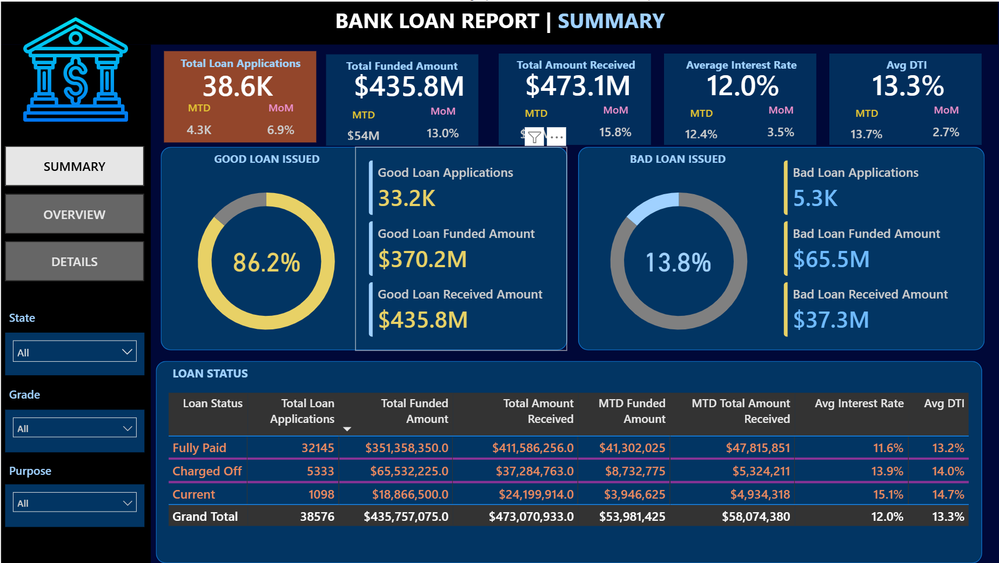
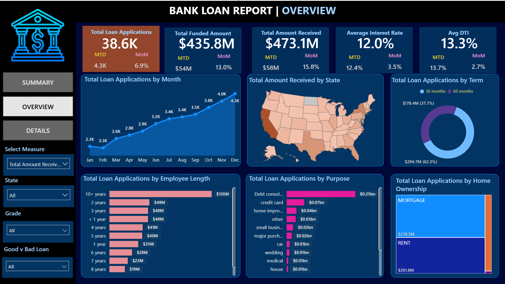
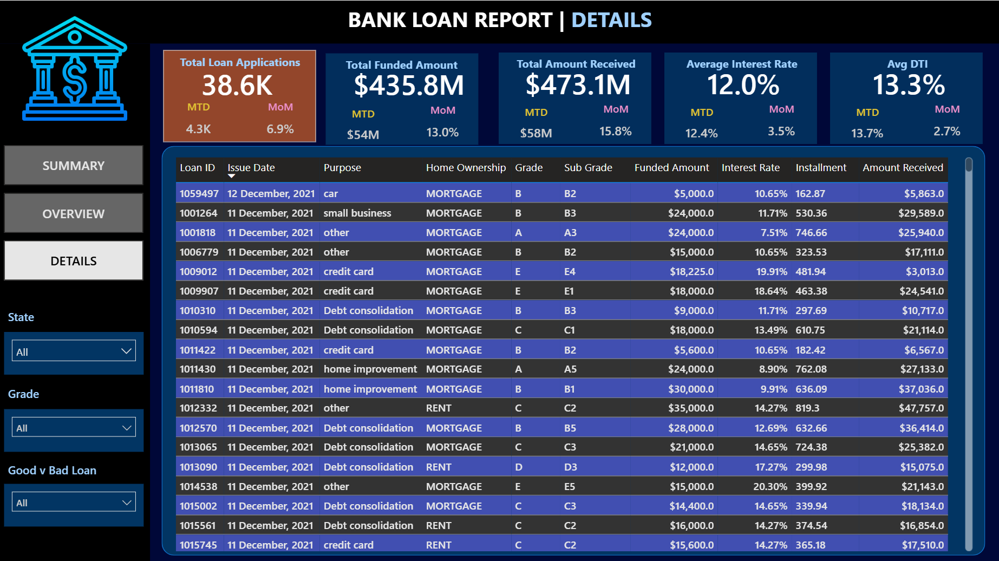
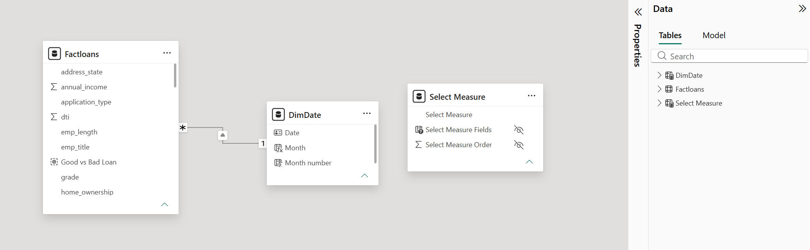

# Bank Loan Portfolio Analysis | Power BI

An interactive Power BI dashboard built to evaluate loan portfolio growth,
funding activity, repayment performance, borrower segments and loan quality.
The dashboard combines Power Query, data modelling, DAX and SQL validation to
support portfolio and credit-risk decisions.

[Download Power BI Dashboard](Bank_Loan_Portfolio_Dashboard.pbix) |
[View DAX Measures](dax/measures.dax) |
[View SQL Validation](sql/kpi_validation.sql) |
[View Documentation](docs/)



## Project Snapshot

| KPI | Result |
|---|---:|
| Total Loan Applications | 38,576 |
| Total Funded Amount | $435.8M |
| Total Amount Received | $473.1M |
| Average Interest Rate | 12.0% |
| Average DTI | 13.3% |
| MTD Loan Applications | 4,314 |
| Application MoM Growth | 6.9% |
| Good Loan Percentage | 86.2% |
| Bad Loan Percentage | 13.8% |

## Business Problem

Lending teams need a reliable way to monitor application growth, funding,
repayment performance and portfolio quality without reviewing individual loan
records manually.

I built this dashboard to answer five practical questions:

1. How large is the loan portfolio?
2. Is the portfolio growing month over month?
3. What proportion of applications are performing or charged off?
4. Which states, purposes, terms and borrower groups drive application volume?
5. Where should portfolio and credit-risk teams focus their attention?

## Intended Users

- Portfolio managers
- Credit-risk analysts
- Lending operations managers
- Finance and business analysts
- Management reporting teams

## Tools and Skills Demonstrated

- Power BI Desktop
- Power Query
- DAX
- SQL Server
- Data modelling
- Time-intelligence calculations
- KPI validation
- Financial data analysis
- Dashboard design and accessibility
- Business insight development

## Dashboard Pages

### 1. Executive Summary

The Summary page presents the portfolio’s main KPIs:

- Total Loan Applications
- Total Funded Amount
- Total Amount Received
- Average Interest Rate
- Average DTI
- MTD values
- Month-over-month movement
- Good-loan and bad-loan performance
- Loan-status breakdown

Good loans include `Fully Paid` and `Current` applications. `Charged Off`
applications are classified as bad loans for this portfolio view.

### 2. Portfolio Overview

The Overview page explains where applications and portfolio value originate.

It includes:

- Monthly application trend
- State-level geographic distribution
- Loan-term composition
- Employment-length analysis
- Loan-purpose analysis
- Home-ownership segmentation
- Grade and loan-quality filters
- Dynamic metric selection



### 3. Loan Details

The Details page provides a record-level view for investigating individual loan
applications and comparing financial characteristics.



## Data Model

The report uses a simple analytical model:

- `Factloans` contains loan-level transaction and borrower attributes.
- `DimDate` supports monthly, MTD and MoM calculations.
- `Select Measure` is a disconnected selector used to change the metric displayed
  on the Overview page.

The primary active relationship is:

```text
DimDate[Date] 1 → * Factloans[issue_date]
```



## Core KPI Definitions

| KPI | Calculation |
|---|---|
| Total Loan Applications | Count of loan application IDs |
| Total Funded Amount | Sum of `loan_amount` |
| Total Amount Received | Sum of `total_payment` |
| Average Interest Rate | Average of `int_rate` |
| Average DTI | Average of `dti` |
| Good Loan Percentage | Good applications divided by total applications |
| Bad Loan Percentage | Charged-off applications divided by total applications |
| MoM Growth | Current-period result compared with the previous period |

The complete formulas are available in
[`dax/measures.dax`](dax/measures.dax).

## Data Preparation

The dataset was prepared and checked using Power Query and SQL.

The main preparation activities included:

- Reviewing headers and source structure
- Checking loan IDs for duplicates
- Reviewing missing values in essential KPI fields
- Applying correct date, numeric and text data types
- Formatting interest rate and DTI as percentages
- Reviewing categorical labels
- Creating a dedicated date table
- Creating an active date relationship
- Classifying good and bad loans
- Comparing SQL results with Power BI measures

The complete preparation decisions are documented in
[`docs/data_cleaning.md`](docs/data_cleaning.md).

## SQL KPI Validation

The dashboard results were independently checked using SQL Server.

| Power BI metric | SQL validation |
|---|---|
| Total Loan Applications | `COUNT(id)` |
| Total Funded Amount | `SUM(loan_amount)` |
| Total Amount Received | `SUM(total_payment)` |
| Average Interest Rate | `AVG(int_rate)` |
| Average DTI | `AVG(dti)` |
| Good/Bad Loan Percentage | Conditional loan-status classification |
| MTD and MoM | Date-based conditional aggregation |

The validation script also checks:

- Missing essential values
- Duplicate loan IDs
- Dataset date coverage
- Monthly application trends
- Loan-status results
- State, term, purpose and grade breakdowns

See [`sql/kpi_validation.sql`](sql/kpi_validation.sql).

## Key Business Insights

### 1. The portfolio has meaningful scale

The dataset contains 38,576 loan applications and approximately $435.8M in
funded principal. Cumulative amount received is approximately $473.1M.

Amount received is not treated as profit because it can include principal,
interest, fees and recovery payments.

### 2. Most applications are performing

Approximately 86.2% of applications are classified as good loans, while 13.8%
are classified as bad loans.

The portfolio is mostly performing, but the charged-off share remains large
enough to justify continued risk monitoring.

### 3. The bad-loan segment has a material payment gap

Bad loans represent approximately $65.5M in funded amount and approximately
$37.3M in amount received.

The amount received from this segment is roughly 57% of funded principal. This
is a portfolio indicator and should not be interpreted as the final accounting
loss rate.

### 4. The latest dataset month shows positive momentum

The latest month contains 4,314 applications, approximately 6.9% higher than the
previous month.

Funded amount grew by approximately 13.0%, while amount received associated with
the selected loan cohort grew by approximately 15.8%.

### 5. Shorter-term loans dominate the portfolio

Approximately 28.2K applications use a 36-month term, representing about 73% of
the portfolio. Approximately 10.3K applications use a 60-month term.

### 6. Debt consolidation is the largest loan purpose

Approximately 18.2K applications, or about 47% of the portfolio, are associated
with debt consolidation. This makes it an important segment for monitoring
grade, DTI, interest rate and charged-off performance.

## Recommendations

1. **Investigate bad-loan concentrations:** Analyse charged-off rates by grade,
   sub-grade, DTI, purpose, term, state and employment length.

2. **Monitor portfolio concentration:** Review the dominance of 36-month and
   debt-consolidation loans alongside their loan-quality results.

3. **Create early-warning indicators:** Add delinquency, outstanding principal,
   days-past-due and payment-due information when available.

4. **Evaluate growth together with risk:** Application growth should be reviewed
   alongside average loan size, grade mix, bad-loan percentage and repayment
   performance.

5. **Expand profitability analysis:** Add funding cost, recovery cost, operating
   expenses and outstanding principal before interpreting payments as profit.

More detail is available in
[`docs/insights_and_recommendations.md`](docs/insights_and_recommendations.md).

## Dataset

The analysis uses a loan-level portfolio dataset containing 38,576 records.
Each row represents one loan application.

The field-level documentation is available in
[`docs/data_dictionary.md`](docs/data_dictionary.md).

## Repository Structure

```text
bank-loan-portfolio-analysis-power-bi/
├── Bank_Loan_Portfolio_Dashboard.pbix
├── README.md
├── assets/
│   ├── 01_executive_summary.png
│   ├── 02_portfolio_overview.png
│   ├── 03_loan_details.png
│   └── data_model.png
├── data/
│   └── financial_loan.csv
├── dax/
│   └── measures.dax
├── sql/
│   └── kpi_validation.sql
└── docs/
    ├── data_dictionary.md
    ├── data_cleaning.md
    ├── insights_and_recommendations.md
    └── limitations.md
```

## How to Use the Project

1. Download or clone this repository.
2. Open `Bank_Loan_Portfolio_Dashboard.pbix` in Power BI Desktop.
3. If refresh reports a missing source, open **Data source settings**.
4. Change the source path to `data/financial_loan.csv`.
5. Select **Refresh**.
6. Use the Summary, Overview and Details navigation buttons.
7. Clear slicers before comparing results with the SQL validation script.

## Assumptions and Limitations

- The report uses historical rather than live loan data.
- MTD refers to the latest month represented in the dataset.
- `issue_date` drives time-intelligence calculations.
- Current loans are classified as good even though their final outcome is not
  yet known.
- Amount received is not equivalent to profit.
- The good-versus-bad classification is simplified for portfolio reporting.
- The analysis identifies associations rather than causal relationships.

See [`docs/limitations.md`](docs/limitations.md) for the complete explanation.

## Author

**Yuvraj Aditya**

B.Tech Computer Science graduate from VIT Bhopal with a focus on data analytics,
business intelligence and reporting.

- GitHub: [yuvrajaditya831-cmd](https://github.com/yuvrajaditya831-cmd)
- LinkedIn: [Yuvraj Aditya](https://www.linkedin.com/in/yuvraj-aditya-802a4721b)

---

If this project helped you understand the portfolio, feel free to explore the
DAX measures, SQL validation queries and supporting documentation.
